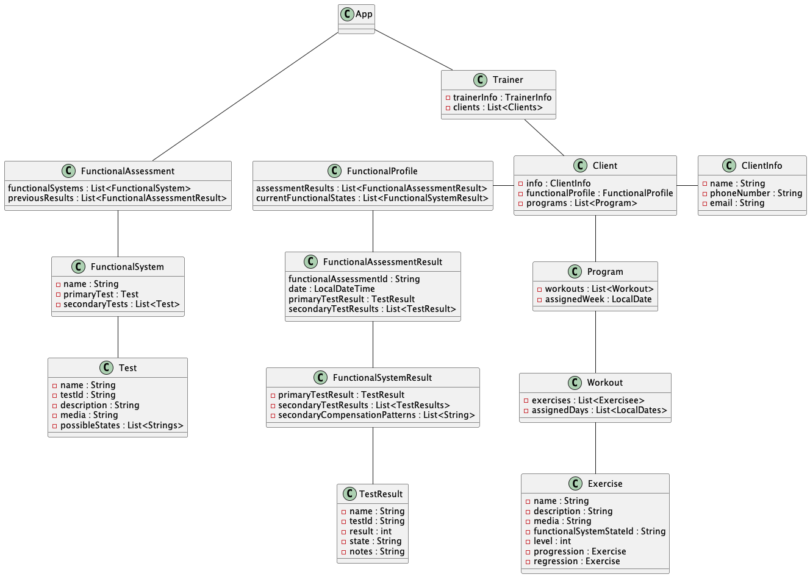

# MuscleSync
### Description:
MuscleSync is built to help personal trainers create more personalized workout plans for their clients. The trainer (user) will be able to run physical assessments on their clients by performing a series of tests. The "assessment result" will highlight muscle imbalances and compensatory movement patterns that the trainer will want to target. The trainer can build workout routines made up of individual exercises that specifically target the muscles that are causing the improper movement patterns. The trainer can also track the their client's progress by running new assessments and comparing to older assessments. At MuscleSync we're putting the "personal" back in "personal training"!

---
## User Stories
1. "New Client" - Trainer (user) will be able to create new clients with personal info, available equipment, and any fitness considerations (pregnancy history, disability, etc.)
2. "Client Details" - Trainer can select from their list of clients when they have a training session. This will display helpful information for the trainer when working with the client.
3. "Functional Assessment" - Trainer can run a Functional Assessment on a client. This is a series of physical tests administered by the trainer. Each test will belong to 1 of 5 functional systems. A functional system can have one of 3 states, which included neutral and the two opposing ranges.
4. "Secondary Tests" - Functional Systems optionally may have secondary tests. These will highlight any secondary movement compensation patterns that contradict the primary functional movement that the trainer can then address.
5. "Functional Profile" - The test results will be compiled into a FunctionalProfile, which is the current functional state of the client.
6. "Functional Goals" - Trainer will be able to manually edit the Functional Profile, and select the areas they'd like to address in building their workout. These will become a list of functional goals that Exercises will address.
7. "Select Exercises" - Trainer can select specific exercises to address any Functional Goals the client may have. Functional Goals will have many associated exercises, organized by a difficulty level. This will allows trainer to easily select progressively more challenging versions of an exercises, or regress them to an easier exercise.
8. "Build Workout" - Trainer can build a workout plan, which is a series of exercises.  This may be adding additional comments or highlighting specific queues that the client finds the most helpful.
9. "Workout Program" - Trainer can package one or several "Workouts" into a "Program" and send the program to their client via email.
10. "Delete Client" - Trainer can remove a client from their current list. This will  be a soft delete, so that if a client ever returns, the trainer will have access to old information.
### Stretch Stories
1. "New Exercises" - Trainer can upload their own Exercises and select which functional systems state they apply to.
2. "Tailor Exercise" - Exercises will have an initial default state, like a list of cues or perhaps a video. Trainer can tailor the exercise for the specific client by editing queues or adding a video that speaks directly to them reminding them of their personal queues that help them achieve proper form. These will be stored in a "Tailored Exercise DB" to differentiate from our template exercises.
3. "Exercise Media" - Trainer can upload custom videos for exercises or 3d animations showing movements. In the
4. "Exercise Relationships" - Exercises can have direct progressions and regressions.
5. "Functional Progress" - Trainer can view clients progress by comparing past Functional Profiles to a current one to illuminate what's working and what needs more attention.
6. "New Tests" - Trainer can add their own tests
7. "Custom Assessment" - Trainer can change the flow of the tests to better match how they work
8. "Template Workouts" - Trainer can save a workout as a template, so that if a client has a similar functional profile
---

## UML Diagram

---
## App Tables
##### Exercises Table
- pk : functionalSystemState (S)
- sk : name (S)
##### Tests Tab le
- pk : functionalSystem
- sk : name (S)
##### FunctionalSystems Table
- pk : name (S)

## User Tables
##### Clients Table
- pk : trainerId (S)
- sk : clientName (S)
- clientInfo (S)
##### AssessmentResults Table
- pk : clientId (S)
- sk : date (S)
- FunctionalSystemResults (S)
- TestResults (S)
##### Programs Table
- pk : clientId (S)
- sk : date (S)
- List<Workouts>
  - List<Exercises>

---

## EndPoints
- A description of each API endpoint that includes:
    - Name
    - A brief description
    - HTTP method
    - Path, including any path parameters
    - Query string parameters (if applicable)
    - Request body (if applicable)
    - Response body
    - A description of any errors the endpoint might return
---

## Sequence Diagram
- A UML sequence diagram of the process of at least one endpoint
---

## Mockups

### Home Page

### Client Page

### Functional Assessment Input Form 

### Workout Builder

---

## Other AWS Services
- RDS for app wide tables
- React for front end